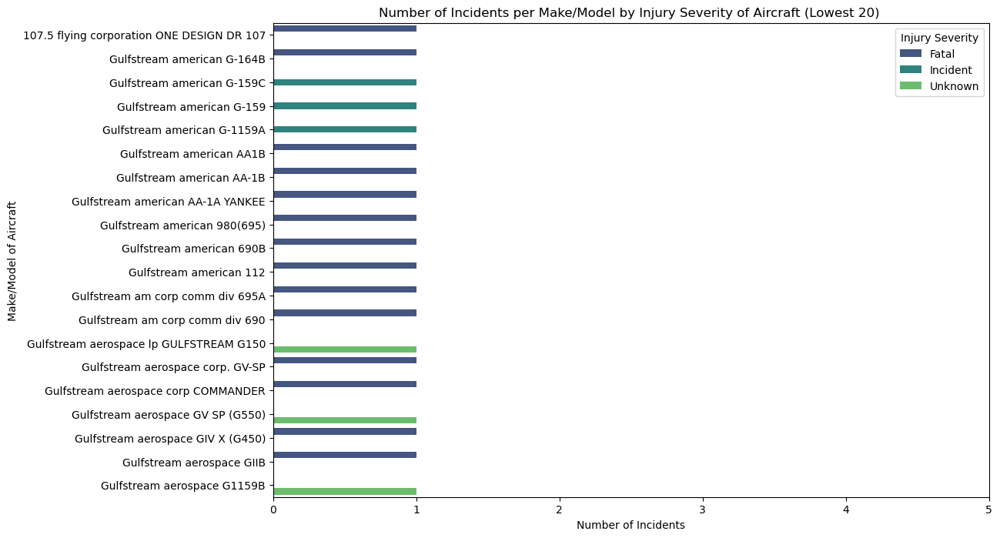

# Aviation Accidents Analysis - Phase 1 Project


## 1. Project Overview 
Your company is expanding in to new industries to diversify its portfolio. Specifically, they are interested in purchasing and operating airplanes for commercial and private enterprises, but do not know anything about the potential risks of aircraft. You are charged with determining which aircraft are the lowest risk for the company to start this new business endeavor. You must then translate your findings into actionable insights that the head of the new aviation division can use to help decide which aircraft to purchase.


## 2. Defining the Question
**Problem Statement :** *Determine which aircraft are the lowest risk for the company to purchase and operate, providing actionable insights for decision-making.*

### Understanding the Context and Data Relevance
From our dataset, there are a few columns that can be used to determine the risk factor of each Make/Model.
To determine risk, we can use variables such as:
* Incident Frequency: Number of incidents per aircraft make/model.
* Severity of Incidents: Categorized by total fatalities, serious injuries, minor injuries, and uninjured passengers.
* Aircraft Damage: Types of damage recorded (e.g., destroyed, substantial, minor).
* Phase of Flight: Common phases during which incidents occur (e.g., landing, takeoff).
* Weather Conditions: Incidents correlated with different weather conditions.


### Data Understanding

In this project, we will be working with a [Kaggle dataset](https://www.kaggle.com/datasets/khsamaha/aviation-accident-database-synopses/data) from the National Transportation Safety Board that includes aviation accident data from 1962 to 2023 about civil aviation accidents and selected incidents in the United States and international waters.

The data is contained is two separate CSV files: 
1. `AviationData.csv`: each record represents data about an accident that occurred with attributes such ad date, Location etc...
2. `USState_Codes.csv`: the state name and its associated abbreviation

To answer our question, relevant columns include model, make, number of accidents/incidents and severity

   

## 3. Reading the data


```python
#import the necessary libraries 
import pandas as pd
import numpy as np
import matplotlib.pyplot as plt
import seaborn as sns
%matplotlib inline
```


```python
#load data into a dataframe
pd.set_option('display.max_columns', None)
df = pd.read_csv('AviationData.csv', encoding= 'latin1', low_memory = False)

#preview top 5 records of the dataset
df.head()
```


<div>
<style scoped>
    .dataframe tbody tr th:only-of-type {
        vertical-align: middle;
    }

    .dataframe tbody tr th {
        vertical-align: top;
    }

    .dataframe thead th {
        text-align: right;
    }
</style>
<table border="1" class="dataframe">
  <thead>
    <tr style="text-align: right;">
      <th></th>
      <th>Event.Id</th>
      <th>Investigation.Type</th>
      <th>Accident.Number</th>
      <th>Event.Date</th>
      <th>Location</th>
      <th>Country</th>
      <th>Latitude</th>
      <th>Longitude</th>
      <th>Airport.Code</th>
      <th>Airport.Name</th>
      <th>Injury.Severity</th>
      <th>Aircraft.damage</th>
      <th>Aircraft.Category</th>
      <th>Registration.Number</th>
      <th>Make</th>
      <th>Model</th>
      <th>Amateur.Built</th>
      <th>Number.of.Engines</th>
      <th>Engine.Type</th>
      <th>FAR.Description</th>
      <th>Schedule</th>
      <th>Purpose.of.flight</th>
      <th>Air.carrier</th>
      <th>Total.Fatal.Injuries</th>
      <th>Total.Serious.Injuries</th>
      <th>Total.Minor.Injuries</th>
      <th>Total.Uninjured</th>
      <th>Weather.Condition</th>
      <th>Broad.phase.of.flight</th>
      <th>Report.Status</th>
      <th>Publication.Date</th>
    </tr>
  </thead>
  <tbody>
    <tr>
      <th>0</th>
      <td>20001218X45444</td>
      <td>Accident</td>
      <td>SEA87LA080</td>
      <td>1948-10-24</td>
      <td>MOOSE CREEK, ID</td>
      <td>United States</td>
      <td>NaN</td>
      <td>NaN</td>
      <td>NaN</td>
      <td>NaN</td>
      <td>Fatal(2)</td>
      <td>Destroyed</td>
      <td>NaN</td>
      <td>NC6404</td>
      <td>Stinson</td>
      <td>108-3</td>
      <td>No</td>
      <td>1.0</td>
      <td>Reciprocating</td>
      <td>NaN</td>
      <td>NaN</td>
      <td>Personal</td>
      <td>NaN</td>
      <td>2.0</td>
      <td>0.0</td>
      <td>0.0</td>
      <td>0.0</td>
      <td>UNK</td>
      <td>Cruise</td>
      <td>Probable Cause</td>
      <td>NaN</td>
    </tr>
    <tr>
      <th>1</th>
      <td>20001218X45447</td>
      <td>Accident</td>
      <td>LAX94LA336</td>
      <td>1962-07-19</td>
      <td>BRIDGEPORT, CA</td>
      <td>United States</td>
      <td>NaN</td>
      <td>NaN</td>
      <td>NaN</td>
      <td>NaN</td>
      <td>Fatal(4)</td>
      <td>Destroyed</td>
      <td>NaN</td>
      <td>N5069P</td>
      <td>Piper</td>
      <td>PA24-180</td>
      <td>No</td>
      <td>1.0</td>
      <td>Reciprocating</td>
      <td>NaN</td>
      <td>NaN</td>
      <td>Personal</td>
      <td>NaN</td>
      <td>4.0</td>
      <td>0.0</td>
      <td>0.0</td>
      <td>0.0</td>
      <td>UNK</td>
      <td>Unknown</td>
      <td>Probable Cause</td>
      <td>19-09-1996</td>
    </tr>
    <tr>
      <th>2</th>
      <td>20061025X01555</td>
      <td>Accident</td>
      <td>NYC07LA005</td>
      <td>1974-08-30</td>
      <td>Saltville, VA</td>
      <td>United States</td>
      <td>36.922223</td>
      <td>-81.878056</td>
      <td>NaN</td>
      <td>NaN</td>
      <td>Fatal(3)</td>
      <td>Destroyed</td>
      <td>NaN</td>
      <td>N5142R</td>
      <td>Cessna</td>
      <td>172M</td>
      <td>No</td>
      <td>1.0</td>
      <td>Reciprocating</td>
      <td>NaN</td>
      <td>NaN</td>
      <td>Personal</td>
      <td>NaN</td>
      <td>3.0</td>
      <td>NaN</td>
      <td>NaN</td>
      <td>NaN</td>
      <td>IMC</td>
      <td>Cruise</td>
      <td>Probable Cause</td>
      <td>26-02-2007</td>
    </tr>
    <tr>
      <th>3</th>
      <td>20001218X45448</td>
      <td>Accident</td>
      <td>LAX96LA321</td>
      <td>1977-06-19</td>
      <td>EUREKA, CA</td>
      <td>United States</td>
      <td>NaN</td>
      <td>NaN</td>
      <td>NaN</td>
      <td>NaN</td>
      <td>Fatal(2)</td>
      <td>Destroyed</td>
      <td>NaN</td>
      <td>N1168J</td>
      <td>Rockwell</td>
      <td>112</td>
      <td>No</td>
      <td>1.0</td>
      <td>Reciprocating</td>
      <td>NaN</td>
      <td>NaN</td>
      <td>Personal</td>
      <td>NaN</td>
      <td>2.0</td>
      <td>0.0</td>
      <td>0.0</td>
      <td>0.0</td>
      <td>IMC</td>
      <td>Cruise</td>
      <td>Probable Cause</td>
      <td>12-09-2000</td>
    </tr>
    <tr>
      <th>4</th>
      <td>20041105X01764</td>
      <td>Accident</td>
      <td>CHI79FA064</td>
      <td>1979-08-02</td>
      <td>Canton, OH</td>
      <td>United States</td>
      <td>NaN</td>
      <td>NaN</td>
      <td>NaN</td>
      <td>NaN</td>
      <td>Fatal(1)</td>
      <td>Destroyed</td>
      <td>NaN</td>
      <td>N15NY</td>
      <td>Cessna</td>
      <td>501</td>
      <td>No</td>
      <td>NaN</td>
      <td>NaN</td>
      <td>NaN</td>
      <td>NaN</td>
      <td>Personal</td>
      <td>NaN</td>
      <td>1.0</td>
      <td>2.0</td>
      <td>NaN</td>
      <td>0.0</td>
      <td>VMC</td>
      <td>Approach</td>
      <td>Probable Cause</td>
      <td>16-04-1980</td>
    </tr>
  </tbody>
</table>
</div>


```python
#loading the other dataset
state_codes = pd.read_csv('USState_Codes.csv')
state_codes.head()
```


<div>
<style scoped>
    .dataframe tbody tr th:only-of-type {
        vertical-align: middle;
    }

    .dataframe tbody tr th {
        vertical-align: top;
    }

    .dataframe thead th {
        text-align: right;
    }
</style>
<table border="1" class="dataframe">
  <thead>
    <tr style="text-align: right;">
      <th></th>
      <th>US_State</th>
      <th>Abbreviation</th>
    </tr>
  </thead>
  <tbody>
    <tr>
      <th>0</th>
      <td>Alabama</td>
      <td>AL</td>
    </tr>
    <tr>
      <th>1</th>
      <td>Alaska</td>
      <td>AK</td>
    </tr>
    <tr>
      <th>2</th>
      <td>Arizona</td>
      <td>AZ</td>
    </tr>
    <tr>
      <th>3</th>
      <td>Arkansas</td>
      <td>AR</td>
    </tr>
    <tr>
      <th>4</th>
      <td>California</td>
      <td>CA</td>
    </tr>
  </tbody>
</table>
</div>


```python
#getting an overview of our data's structure and completeness i.e.,columns names, non-null counts and datatypes
state_codes.info()
```

    <class 'pandas.core.frame.DataFrame'>
    RangeIndex: 62 entries, 0 to 61
    Data columns (total 2 columns):
     #   Column        Non-Null Count  Dtype 
    ---  ------        --------------  ----- 
     0   US_State      62 non-null     object
     1   Abbreviation  62 non-null     object
    dtypes: object(2)
    memory usage: 1.1+ KB
    

Given the large number of columns available in our dataset, I will not be using all of them in this analysis. Therefore, I select the relevant ones and store them in a new dataframe.


```python
#select the columns relevant in answering our business question
relevant_columns = ['Event.Id', 'Event.Date', 'Location','Investigation.Type', 'Injury.Severity', 'Aircraft.damage', 'Make', 'Model',  'Total.Fatal.Injuries',
       'Total.Serious.Injuries', 'Total.Minor.Injuries', 'Total.Uninjured','Weather.Condition', 'Broad.phase.of.flight']
aviation_data = df[relevant_columns]
```


```python
# Convert the 'Event.Date' column to datetime format
aviation_data.loc[:, 'Event.Date'] = pd.to_datetime(aviation_data['Event.Date'])
```


```python
#getting an overview of our data's structure and completeness i.e.,columns names, non-null counts and datatypes
aviation_data.info()
```

    <class 'pandas.core.frame.DataFrame'>
    RangeIndex: 88889 entries, 0 to 88888
    Data columns (total 14 columns):
     #   Column                  Non-Null Count  Dtype  
    ---  ------                  --------------  -----  
     0   Event.Id                88889 non-null  object 
     1   Event.Date              88889 non-null  object 
     2   Location                88837 non-null  object 
     3   Investigation.Type      88889 non-null  object 
     4   Injury.Severity         87889 non-null  object 
     5   Aircraft.damage         85695 non-null  object 
     6   Make                    88826 non-null  object 
     7   Model                   88797 non-null  object 
     8   Total.Fatal.Injuries    77488 non-null  float64
     9   Total.Serious.Injuries  76379 non-null  float64
     10  Total.Minor.Injuries    76956 non-null  float64
     11  Total.Uninjured         82977 non-null  float64
     12  Weather.Condition       84397 non-null  object 
     13  Broad.phase.of.flight   61724 non-null  object 
    dtypes: float64(4), object(10)
    memory usage: 9.5+ MB
    


```python
#check for duplicates and drop them
aviation_data = aviation_data.drop_duplicates()
# aviation_data.shape
```


```python
#code for checking the number of missing values
aviation_data.isna().sum()
```


    Event.Id                      0
    Event.Date                    0
    Location                     52
    Investigation.Type            0
    Injury.Severity             999
    Aircraft.damage            3191
    Make                         63
    Model                        92
    Total.Fatal.Injuries      11398
    Total.Serious.Injuries    12503
    Total.Minor.Injuries      11926
    Total.Uninjured            5908
    Weather.Condition          4491
    Broad.phase.of.flight     27161
    dtype: int64


## 4. Tidying the Dataset

### **Question 1:** *What is the distribution of incidents per make/model of aircraft?*
Our question is to identify which aircraft has the lowest risk.

To determine which aircraft make/model combination have the lowest risk, we need to calculate the incident frequency for each and take the lowest value. 


The `Make` and `Model` columns contain 63 and 92 missing values respectively, which represents 0.07% & 0.1% of the total records respectively. For this 
Part, I am choosing to drop the null values as it ensures that the data remains complete without significantly impacting the dataset size.

I thought about mapping the `Model` column to the `Make` column to extrapolate and fill `Models` where the `Makes` match. 
However, it is important to note that aircrafts can be the same make and different models. Therefore, this would have introduced a bias. 


```python
aviation_cleaned = aviation_data.dropna(subset = ['Make', 'Model'])
# aviation_cleaned..head()
```


```python
aviation_cleaned.shape
```


    (88744, 14)


Now using the `value_counts()` method, Let's check the distribution of data i.e., unique make and frequency of each.


```python
# Number of incidents per model
make_counts = aviation_cleaned['Make'].value_counts()
make_counts
```


    Make
    Cessna           22219
    Piper            12028
    CESSNA            4918
    Beech             4330
    PIPER             2840
                     ...  
    Conrad Menzel        1
    Blucher              1
    Gideon               1
    Brault               1
    ROYSE RALPH L        1
    Name: count, Length: 8224, dtype: int64


Now from what we can see, we notice that we have same Makes but different capitalization e.g., (`Cessna` & `CESSNA`, `PIPER` & `Piper`). I decided to convert all the Strings in the `Make` column into Capitalized case to ensure uniformity. Moreover, it is noted that  `Hawker beech`,`Hawker beechcraft corp.` & `Hawker beechcraft corporation` all which refer to the same make but treated differently in this case. So I will Unify them as well.


```python
#capitalize aviation makes to promote uniformity
aviation_cleaned.loc[:, 'Make'] = aviation_cleaned['Make'].str.capitalize()

#remove any trailing and leading spaces 
aviation_cleaned.loc[:, 'Make'] = aviation_cleaned['Make'].str.strip()

```


```python

'''This line of code will replace all variations of 'Hawker beech' with 'Hawker beechcraft', including 'Hawker beechcraft corp.', 'Hawker beechcraft 
corporation', and any other variations in the 'Make' column of your DataFrame df. The regular expression r'Hawker\s*beech.*' 
matches any string that starts with 'Hawker beech' followed by zero or more whitespace characters (\s*) and any other characters (.*).'''

# Replace variations of 'Hawker' and 'Hawker beech' with 'Hawker beechcraft'
aviation_cleaned.loc[:, 'Make'] = aviation_cleaned['Make'].str.replace(r'(Hawker\s*beech|Hawker|Beech|Hawker beachcraftcraft)', 'Hawker beechcraft', regex=True)


```

While trying to plot the distribution of the `Make` column, I ran into an error `FutureWarning: use_inf_as_na option is deprecated and 
will be removed in a future version. Convert inf values to NaN before operating instead.` This is likely due to the Make column containing a large number of unique categories, which can make it difficult to visualize thus not producing a meaningful histogram/barplot.  Therefore, I decided to plot a sample of the whole, like the top 20.


```python
aviation_cleaned.info()
```

    <class 'pandas.core.frame.DataFrame'>
    Index: 88744 entries, 0 to 88888
    Data columns (total 14 columns):
     #   Column                  Non-Null Count  Dtype  
    ---  ------                  --------------  -----  
     0   Event.Id                88744 non-null  object 
     1   Event.Date              88744 non-null  object 
     2   Location                88692 non-null  object 
     3   Investigation.Type      88744 non-null  object 
     4   Injury.Severity         87766 non-null  object 
     5   Aircraft.damage         85575 non-null  object 
     6   Make                    88744 non-null  object 
     7   Model                   88744 non-null  object 
     8   Total.Fatal.Injuries    77361 non-null  float64
     9   Total.Serious.Injuries  76261 non-null  float64
     10  Total.Minor.Injuries    76837 non-null  float64
     11  Total.Uninjured         82851 non-null  float64
     12  Weather.Condition       84306 non-null  object 
     13  Broad.phase.of.flight   61654 non-null  object 
    dtypes: float64(4), object(10)
    memory usage: 10.2+ MB
    


```python
# Count the number of incidents per make
make_counts = aviation_cleaned['Make'].value_counts()
```


```python
# Let's get the top 20 makes to keep the plot readable
low_make_counts = make_counts.tail(20)
low_make_counts
```


    Make
    Pank                        1
    Mckean                      1
    S. piccolotto/dave morss    1
    Lewis-pexton                1
    Denzer                      1
    Aune                        1
    Seattle aerotech            1
    Fay                         1
    Lonnie w. ratliff           1
    Bumgarner                   1
    Lidster                     1
    Murawski                    1
    Wsk pzl swidnik             1
    Castle                      1
    Quinn                       1
    Meeuwsen gordon             1
    Hulle                       1
    Dorfman,william a.          1
    Firm                        1
    Royse ralph l               1
    Name: count, dtype: int64


```python
# Plot the bar plot for the top makes
plt.figure(figsize=(12, 8))
sns.barplot(x=low_make_counts.values, y=low_make_counts.index, palette='viridis')
plt.title('Number of Incidents per Make of Aircraft(Bottom 20)')
plt.xlabel('Number of Incidents')
plt.ylabel('Make of Aircraft');


```


    

    


From the above graph, we notice that each Make in the Lowest 20 has 1 incident. From this alone, we cannot determine which would be the lower risk. 

The `Model` column appears to be written in majorly uppercase. Just to be sure and ensure standardization, I am going to change every entry into uppercase by using the `str.upper()` method.


```python
#capitalize aviation makes to promote uniformity
aviation_cleaned.loc[:, 'Model'] = aviation_cleaned['Model'].str.upper()
```


```python
#count number of incidents per aircraft model
model_counts = aviation_cleaned['Model'].value_counts()
#let's get the 20 most common models 
low_20_models = model_counts.tail(20)
```


```python
# Plot the bar plot for the top makes
plt.figure(figsize=(12, 8))
sns.barplot(x=low_20_models.values, y=low_20_models.index, palette='viridis')
plt.title('Number of Incidents per Model of Aircraft (Bottom 20)')
plt.xlabel('Number of Incidents')
plt.ylabel('Model of Aircraft');

```


    

    


From the above graph, the bottom 20 Models have an incident frequency of 1. From this alone, we cannot determine which aircraft carries a lower risk. However, this combined with other factors might shed more light.


```python
#create a dataframe that stores incident counts. Include the Make and Model
incident_counts = aviation_cleaned.groupby(['Make', 'Model']).size().reset_index(name='Incident.Count')

# Display the top 10 aircraft with the highest incident count
print(incident_counts.sort_values(by='Incident.Count', ascending=False).head(20))

```

                        Make      Model  Incident.Count
    4038              Cessna        152            2363
    4062              Cessna        172            1752
    4113              Cessna       172N            1163
    13396              Piper  PA-28-140             931
    4011              Cessna        150             829
    4111              Cessna       172M             798
    4116              Cessna       172P             687
    4170              Cessna        182             659
    4146              Cessna        180             621
    4037              Cessna       150M             585
    13288              Piper      PA-18             578
    13406              Piper  PA-28-180             572
    13297              Piper  PA-18-150             571
    13405              Piper  PA-28-161             565
    13413              Piper  PA-28-181             529
    1961                Bell       206B             515
    2597              Boeing        737             488
    13553              Piper  PA-38-112             468
    4036              Cessna       150L             460
    8706   Hawker beechcraft        A36             419
    

Now let's visualize the number of incidents per make/model. And since we want the lowest risk i.e., with lower incidents, we will plot for the lowest 20. 


```python
# Sort by 'Incident Count' and select the lowest 20
lowest_20_incidents = incident_counts.sort_values(by='Incident.Count').head(20)

# Combine 'Make' and 'Model' into a single column for better visualization
lowest_20_incidents['Make/Model'] = lowest_20_incidents['Make'] + ' ' + lowest_20_incidents['Model']

# Plot the bar plot
plt.figure(figsize=(12, 8))
sns.barplot(x='Incident.Count', y='Make/Model', data=lowest_20_incidents, palette='viridis')
plt.title('Number of Incidents per Make/Model of Aircraft (Lowest 20)')
plt.xlabel('Number of Incidents')
plt.ylabel('Make/Model of Aircraft')
plt.xlim(0, 5);

```


    

    


We notice that we have several Make/Model aircraft combinations have just 1 incident. This becomes difficult to select the lowest risk of them all as there is no way to differentiate them. 


### **Question 2:** *What is the Severity of Injuries per Make/Model ?*

We notice that unique entries in  the `Injury.Severity` column  are 109. 
Moreover, there are different variations of Fatal with number of fatalities enclosed e.g `Fatal(4).` These are all treated as separate and unique entries. So first, I decided to replace any value that has `Fatal ` to be in the same Category. 
Moreover, I Handle missing values by putting them into a different category, `Missing` to preserve the data.


```python
aviation_cleaned['Injury.Severity'].value_counts()
```


    Injury.Severity
    Non-Fatal     67290
    Fatal(1)       6157
    Fatal          5248
    Fatal(2)       3698
    Incident       2209
                  ...  
    Fatal(270)        1
    Fatal(60)         1
    Fatal(43)         1
    Fatal(143)        1
    Fatal(230)        1
    Name: count, Length: 109, dtype: int64


```python
# aviation_cleaned['Injury.Severity'].unique()
```


```python
aviation_cleaned.head()
```


<div>
<style scoped>
    .dataframe tbody tr th:only-of-type {
        vertical-align: middle;
    }

    .dataframe tbody tr th {
        vertical-align: top;
    }

    .dataframe thead th {
        text-align: right;
    }
</style>
<table border="1" class="dataframe">
  <thead>
    <tr style="text-align: right;">
      <th></th>
      <th>Event.Id</th>
      <th>Event.Date</th>
      <th>Location</th>
      <th>Investigation.Type</th>
      <th>Injury.Severity</th>
      <th>Aircraft.damage</th>
      <th>Make</th>
      <th>Model</th>
      <th>Total.Fatal.Injuries</th>
      <th>Total.Serious.Injuries</th>
      <th>Total.Minor.Injuries</th>
      <th>Total.Uninjured</th>
      <th>Weather.Condition</th>
      <th>Broad.phase.of.flight</th>
    </tr>
  </thead>
  <tbody>
    <tr>
      <th>0</th>
      <td>20001218X45444</td>
      <td>1948-10-24 00:00:00</td>
      <td>MOOSE CREEK, ID</td>
      <td>Accident</td>
      <td>Fatal(2)</td>
      <td>Destroyed</td>
      <td>Stinson</td>
      <td>108-3</td>
      <td>2.0</td>
      <td>0.0</td>
      <td>0.0</td>
      <td>0.0</td>
      <td>UNK</td>
      <td>Cruise</td>
    </tr>
    <tr>
      <th>1</th>
      <td>20001218X45447</td>
      <td>1962-07-19 00:00:00</td>
      <td>BRIDGEPORT, CA</td>
      <td>Accident</td>
      <td>Fatal(4)</td>
      <td>Destroyed</td>
      <td>Piper</td>
      <td>PA24-180</td>
      <td>4.0</td>
      <td>0.0</td>
      <td>0.0</td>
      <td>0.0</td>
      <td>UNK</td>
      <td>Unknown</td>
    </tr>
    <tr>
      <th>2</th>
      <td>20061025X01555</td>
      <td>1974-08-30 00:00:00</td>
      <td>Saltville, VA</td>
      <td>Accident</td>
      <td>Fatal(3)</td>
      <td>Destroyed</td>
      <td>Cessna</td>
      <td>172M</td>
      <td>3.0</td>
      <td>NaN</td>
      <td>NaN</td>
      <td>NaN</td>
      <td>IMC</td>
      <td>Cruise</td>
    </tr>
    <tr>
      <th>3</th>
      <td>20001218X45448</td>
      <td>1977-06-19 00:00:00</td>
      <td>EUREKA, CA</td>
      <td>Accident</td>
      <td>Fatal(2)</td>
      <td>Destroyed</td>
      <td>Rockwell</td>
      <td>112</td>
      <td>2.0</td>
      <td>0.0</td>
      <td>0.0</td>
      <td>0.0</td>
      <td>IMC</td>
      <td>Cruise</td>
    </tr>
    <tr>
      <th>4</th>
      <td>20041105X01764</td>
      <td>1979-08-02 00:00:00</td>
      <td>Canton, OH</td>
      <td>Accident</td>
      <td>Fatal(1)</td>
      <td>Destroyed</td>
      <td>Cessna</td>
      <td>501</td>
      <td>1.0</td>
      <td>2.0</td>
      <td>NaN</td>
      <td>0.0</td>
      <td>VMC</td>
      <td>Approach</td>
    </tr>
  </tbody>
</table>
</div>


```python
#using np.where to identify entries with `fatal()` and replace it with Fatal as it's category.
#first create a copy of the dataframe
aviation_cleaned_copy = aviation_cleaned.copy()

#replace any value containing 'Fatal' to create a different category 
aviation_cleaned_copy['Injury.Severity'] = np.where(aviation_cleaned_copy['Injury.Severity'].str.contains('Fatal', na = False), 'Fatal' , aviation_cleaned_copy['Injury.Severity']) 

```


```python
# Notice that it has 979 missing values. Instead of dropping these values, I
# decided to keep them and give them a class of their own 'Unkown'
aviation_cleaned_copy['Injury.Severity'] = aviation_cleaned_copy['Injury.Severity'].fillna('Unknown')

#preview data to check if changes have taken place
aviation_cleaned_copy.head()

```


<div>
<style scoped>
    .dataframe tbody tr th:only-of-type {
        vertical-align: middle;
    }

    .dataframe tbody tr th {
        vertical-align: top;
    }

    .dataframe thead th {
        text-align: right;
    }
</style>
<table border="1" class="dataframe">
  <thead>
    <tr style="text-align: right;">
      <th></th>
      <th>Event.Id</th>
      <th>Event.Date</th>
      <th>Location</th>
      <th>Investigation.Type</th>
      <th>Injury.Severity</th>
      <th>Aircraft.damage</th>
      <th>Make</th>
      <th>Model</th>
      <th>Total.Fatal.Injuries</th>
      <th>Total.Serious.Injuries</th>
      <th>Total.Minor.Injuries</th>
      <th>Total.Uninjured</th>
      <th>Weather.Condition</th>
      <th>Broad.phase.of.flight</th>
    </tr>
  </thead>
  <tbody>
    <tr>
      <th>0</th>
      <td>20001218X45444</td>
      <td>1948-10-24 00:00:00</td>
      <td>MOOSE CREEK, ID</td>
      <td>Accident</td>
      <td>Fatal</td>
      <td>Destroyed</td>
      <td>Stinson</td>
      <td>108-3</td>
      <td>2.0</td>
      <td>0.0</td>
      <td>0.0</td>
      <td>0.0</td>
      <td>UNK</td>
      <td>Cruise</td>
    </tr>
    <tr>
      <th>1</th>
      <td>20001218X45447</td>
      <td>1962-07-19 00:00:00</td>
      <td>BRIDGEPORT, CA</td>
      <td>Accident</td>
      <td>Fatal</td>
      <td>Destroyed</td>
      <td>Piper</td>
      <td>PA24-180</td>
      <td>4.0</td>
      <td>0.0</td>
      <td>0.0</td>
      <td>0.0</td>
      <td>UNK</td>
      <td>Unknown</td>
    </tr>
    <tr>
      <th>2</th>
      <td>20061025X01555</td>
      <td>1974-08-30 00:00:00</td>
      <td>Saltville, VA</td>
      <td>Accident</td>
      <td>Fatal</td>
      <td>Destroyed</td>
      <td>Cessna</td>
      <td>172M</td>
      <td>3.0</td>
      <td>NaN</td>
      <td>NaN</td>
      <td>NaN</td>
      <td>IMC</td>
      <td>Cruise</td>
    </tr>
    <tr>
      <th>3</th>
      <td>20001218X45448</td>
      <td>1977-06-19 00:00:00</td>
      <td>EUREKA, CA</td>
      <td>Accident</td>
      <td>Fatal</td>
      <td>Destroyed</td>
      <td>Rockwell</td>
      <td>112</td>
      <td>2.0</td>
      <td>0.0</td>
      <td>0.0</td>
      <td>0.0</td>
      <td>IMC</td>
      <td>Cruise</td>
    </tr>
    <tr>
      <th>4</th>
      <td>20041105X01764</td>
      <td>1979-08-02 00:00:00</td>
      <td>Canton, OH</td>
      <td>Accident</td>
      <td>Fatal</td>
      <td>Destroyed</td>
      <td>Cessna</td>
      <td>501</td>
      <td>1.0</td>
      <td>2.0</td>
      <td>NaN</td>
      <td>0.0</td>
      <td>VMC</td>
      <td>Approach</td>
    </tr>
  </tbody>
</table>
</div>


```python
aviation_cleaned_copy.isnull().sum()
```


    Event.Id                      0
    Event.Date                    0
    Location                     52
    Investigation.Type            0
    Injury.Severity               0
    Aircraft.damage            3169
    Make                          0
    Model                         0
    Total.Fatal.Injuries      11383
    Total.Serious.Injuries    12483
    Total.Minor.Injuries      11907
    Total.Uninjured            5893
    Weather.Condition          4438
    Broad.phase.of.flight     27090
    dtype: int64


```python
aviation_cleaned_copy['Injury.Severity'].value_counts()
```


    Injury.Severity
    Fatal          85072
    Incident        2209
    Unknown          978
    Minor            217
    Serious          173
    Unavailable       95
    Name: count, dtype: int64


```python
# Plot the distribution of injury severity

plt.figure(figsize=(12, 8))
sns.countplot(data=aviation_cleaned_copy, x='Injury.Severity', palette='viridis')
plt.title('Distribution of Injury Severity')
plt.xlabel('Injury Severity')
plt.ylabel('Count')
plt.xticks(rotation=45);

```


    

    


From the plot above, most aircraft accidents/incidents result in fatalities. 
Now, we need to investigate the Injury Severity per Make/Model.


```python
#plot graph to show injury severity per Make/Model. We will take the least 20 .

plt.figure(figsize=(12,8))
# Merge the two DataFrames on 'Make' and 'Model'
merged_df = pd.merge(incident_counts, aviation_cleaned_copy, on=['Make', 'Model'])

# Sort by 'Incident Count' and select the lowest 20
lowest_20_incidents = merged_df.sort_values(by='Incident.Count').head(20)

# Combine 'Make' and 'Model' into a single column for better visualization
lowest_20_incidents['Make/Model'] = lowest_20_incidents['Make'] + ' ' + lowest_20_incidents['Model']

# Plot the bar plot
sns.barplot(x='Incident.Count', y='Make/Model',hue='Injury.Severity', data=lowest_20_incidents, palette='viridis');
plt.title('Number of Incidents per Make/Model by Injury Severity of Aircraft (Lowest 20) ')
plt.xlabel('Number of Incidents')
plt.ylabel('Make/Model of Aircraft')
plt.legend(title='Injury Severity');
plt.xlim(0, 5);
```


    

    


From the above plot, we notice that aircrafts of that even in the lower 20 Incident counts, most incidents/accidents result in fatalities. 
However, we still have no way to narrow it down, as 13,906 Make/Model combinations have an incident frequency of 1.


```python
# low = merged_df[merged_df['Incident.Count'] == 1]
# low.count()   #we have 13,906 Make/Model Combinations with an Incident Count of 1. How do we choose from this?
```

### **Question 3:** *What is the distribution of aircraft damage per Make/Model?*


```python
aviation_cleaned_copy3 = aviation_cleaned_copy.copy()

aviation_cleaned_copy3['Aircraft.damage'].unique() # from this, we notice that there are different categories for null and Unkown
```


    array(['Destroyed', 'Substantial', 'Minor', nan, 'Unknown'], dtype=object)


```python
#replace null values with 'Missing'
aviation_cleaned_copy3['Aircraft.damage'] = aviation_cleaned_copy3['Aircraft.damage'].fillna('Missing')
```


```python
#plot distribution of aircraft damage

plt.figure(figsize=(12, 8))
sns.countplot(data=aviation_cleaned_copy3, x='Aircraft.damage', palette='viridis')
plt.title('Distribution of Aircraft Damage')
plt.xlabel('Aircraft Damage')
plt.ylabel('Count');

```


    

    


We notice that most aircrafts sustained `Substantial` damage in the event of an incident.


```python
#now plot the distribution of Aircraft damage per Make/Model


plt.figure(figsize=(12,8))
# Merge the two DataFrames on 'Make' and 'Model'
merged_damage = pd.merge(incident_counts, aviation_cleaned_copy3, on=['Make', 'Model'])
# Sort by 'Incident Count' and select the lowest 20
lowest_20_incidents = merged_damage.sort_values(by='Incident.Count').head(20)

# Combine 'Make' and 'Model' into a single column for better visualization
lowest_20_incidents['Make/Model'] = lowest_20_incidents['Make'] + ' ' + lowest_20_incidents['Model']

# Plot the bar plot
sns.barplot(x='Incident.Count', y='Make/Model',hue='Aircraft.damage', data=lowest_20_incidents, palette='viridis');
plt.title('Number of Incidents per Make/Model by Aircraft Damage of Aircraft (Lowest 20)')
plt.xlabel('Number of Incidents')
plt.ylabel('Make/Model of Aircraft')
plt.legend(title='Aircraft Damage');
plt.xlim(0, 5);

```


    

    


```python

```

### **Question 4:** *Distribution of which Phase of Flight Accidents/incidents commomly occur?*


```python
aviation_cleaned_copy4 = aviation_cleaned_copy3.copy()

aviation_cleaned_copy4['Broad.phase.of.flight'].value_counts()
```


    Broad.phase.of.flight
    Landing        15421
    Takeoff        12479
    Cruise         10259
    Maneuvering     8129
    Approach        6534
    Climb           2030
    Taxi            1953
    Descent         1886
    Go-around       1353
    Standing         943
    Unknown          548
    Other            119
    Name: count, dtype: int64


```python
#create a category to for missing data
aviation_cleaned_copy4['Broad.phase.of.flight'] = aviation_cleaned_copy4['Broad.phase.of.flight'].fillna('Missing')
```


```python
#plot graph to show distribution of when incidents occur

plt.figure(figsize=(12, 8))
sns.countplot(data=aviation_cleaned_copy4, x='Broad.phase.of.flight', palette='viridis')
plt.title('Distribution of Phase of Flight')
plt.xlabel('Phase of Flight')
plt.ylabel('Count')
plt.xticks(rotation = 90);

```


    

    


It is important to note that majority of this data is missing. It might therefore not provide a clear picture for interpretation. 


```python

```

### **Question 5:** *What is the distribution of Weather Conditions when Incidents occur?*


```python
aviation_cleaned_copy5 = aviation_cleaned_copy4.copy()
aviation_cleaned_copy5['Weather.Condition'].value_counts()
```


    Weather.Condition
    VMC    77221
    IMC     5970
    UNK      853
    Unk      262
    Name: count, dtype: int64


```python
#we notice that 5% of our data for the Weather condition is missing. While it is not substantial, it is a good number. 
aviation_cleaned_copy5['Weather.Condition'].isnull().sum() / len(aviation_cleaned_copy5['Weather.Condition'])*100 # find % of missing data
```


    5.000901469395114


`IMC (Incident Meteorological Conditions)` - refers to weather conditions where pilots are not allowed to fly on their own, hence require use of instruments, typically cloudy or low visibility. 
`VMC (Visual Meteorological Conditions)` - refers to weather conditions under which pilots have sufficient visibility to fly aircraft relying on visual references.

It is important to notice that we have (`UNK` and `Unk`)  as 2 separate entries. I decided to capitalize everything and thus have them as the same
category. For this assessment, I am going to assume that `UNK` refers to `UNKOWN` as I did not find it's definition anywhere.
Now, to deal with missing values, I decided to have a separate category for them


```python
# convert strings into uppercase for uniformity
aviation_cleaned_copy5.loc[:, 'Weather.Condition'] = aviation_cleaned_copy5['Weather.Condition'].str.upper()

aviation_cleaned_copy5['Weather.Condition'].unique()
```


    array(['UNK', 'IMC', 'VMC', nan], dtype=object)


```python
aviation_cleaned_copy5['Weather.Condition'] = aviation_cleaned_copy5['Weather.Condition'].fillna('Missing')
```


```python
#plot graph to show distribtion of weather patterns during the occurrence of incidents

plt.figure(figsize=(12, 8))
sns.countplot(data=aviation_cleaned_copy5, x='Weather.Condition', palette='viridis')
plt.title('Distribution of Weather Conditions')
plt.xlabel('Weather Condition')
plt.ylabel('Count');

```


    

    


Most Incidents/Accidents occurred in VMC. This would be ideal conditions for flights, it is therefore investigating further on what would be contributing to such high incident/accident frequency.


```python
#plot distribution of incidents and taking weather conditions into account
plt.figure(figsize=(12,8))
# Merge the two DataFrames on 'Make' and 'Model'
merged_weather= pd.merge(incident_counts, aviation_cleaned_copy5, on=['Make', 'Model'])
# Sort by 'Incident Count' and select the lowest 20
lowest_20_incidents = merged_weather.sort_values(by='Incident.Count').head(20)

# Combine 'Make' and 'Model' into a single column for better visualization
lowest_20_incidents['Make/Model'] = lowest_20_incidents['Make'] + ' ' + lowest_20_incidents['Model']

# Plot the bar plot
sns.barplot(x='Incident.Count', y='Make/Model',hue='Weather.Condition', data=lowest_20_incidents, palette='viridis');
plt.title('Number of Incidents per Make/Model by Weather Conditions')
plt.xlabel('Number of Incidents')
plt.ylabel('Make/Model of Aircraft')
plt.legend(title='Weather Condition');
plt.xlim(0, 5);
```


    

    


The graph above shows the lowest 20 Make/Model combinations by incident Count and the weather conditions under which their accidents/incidents occurred.

### **Question 6:** *What is the Risk Score of each Make/Model Combination?*

The European Aviation Safety Agency (EASA) developed the European Risk Classification Scheme (ERCS) methodology, designed to risk-classify all reported occurrences. This methodology calculates risk  by taking in two variables: Severity and Likelihood of Occurrence(how often similar incidents occur). 
To get the likelihood of occurrence, we count the number of incidents for each 'Make' and 'Model' combination. More frequent incidents imply higher likelihood.


```python
aviation_cleaned_copy6 = aviation_cleaned_copy5.copy()

#fill missing values with 0, in injuries columns
columns_to_fill = ['Total.Fatal.Injuries', 'Total.Serious.Injuries', 'Total.Minor.Injuries', 'Total.Uninjured']
aviation_cleaned_copy6[columns_to_fill ] = aviation_cleaned_copy6[columns_to_fill ].fillna(0)
```


```python
'''The following function calculates the severity score by taking into account the total number of people and weighted injuries. 
This approach normalizes the score and avoids negative scores while also taking into account the uninjured. This is because if no fatalities are
recorded,it is slightly less severe than in the case of fatalities'''

def calculate_risk_score(row):
    total_people = (row['Total.Fatal.Injuries'] + 
                    row['Total.Serious.Injuries'] + 
                    row['Total.Minor.Injuries'] + 
                    row['Total.Uninjured'])
    
    if total_people == 0:
        return 0  # Avoid division by zero
    
    # Calculate the weighted sum of injuries
    weighted_injuries = (row['Total.Fatal.Injuries'] * 10 + 
                         row['Total.Serious.Injuries'] * 5 + 
                         row['Total.Minor.Injuries'] * 1 +
                         row['Total.Uninjured'] * 0.5
                        )
    
    # Calculate the risk score as a proportion of the total
    severity_score = weighted_injuries / total_people
    
    return severity_score

# Apply the function to the dataframe
aviation_cleaned_copy6['Severity.Score'] = aviation_cleaned_copy6.apply(calculate_risk_score, axis=1)

# Check the results
# aviation_cleaned_copy6[['Total.Fatal.Injuries', 'Total.Serious.Injuries', 'Total.Minor.Injuries', 'Total.Uninjured', 'Severity.Score']].head(10)

```


```python

# Merge counts back into the main DataFrame
aviation_cleaned_copy6 = aviation_cleaned_copy6.merge(incident_counts, on=['Make', 'Model'])

# Normalize incident counts to likelihood scores between 1 and 5
aviation_cleaned_copy6['Likelihood.Score'] = pd.cut(aviation_cleaned_copy6['Incident.Count'], bins=5, labels=[1, 2, 3, 4, 5]).astype(int)

```


```python
# Calculate the ERCS score
aviation_cleaned_copy6['ERCS.Score'] = aviation_cleaned_copy6['Severity.Score'] * aviation_cleaned_copy6['Likelihood.Score']

```


```python
aviation_cleaned_copy6.tail()
```


<div>
<style scoped>
    .dataframe tbody tr th:only-of-type {
        vertical-align: middle;
    }

    .dataframe tbody tr th {
        vertical-align: top;
    }

    .dataframe thead th {
        text-align: right;
    }
</style>
<table border="1" class="dataframe">
  <thead>
    <tr style="text-align: right;">
      <th></th>
      <th>Event.Id</th>
      <th>Event.Date</th>
      <th>Location</th>
      <th>Investigation.Type</th>
      <th>Injury.Severity</th>
      <th>Aircraft.damage</th>
      <th>Make</th>
      <th>Model</th>
      <th>Total.Fatal.Injuries</th>
      <th>Total.Serious.Injuries</th>
      <th>Total.Minor.Injuries</th>
      <th>Total.Uninjured</th>
      <th>Weather.Condition</th>
      <th>Broad.phase.of.flight</th>
      <th>Severity.Score</th>
      <th>Incident.Count</th>
      <th>Likelihood.Score</th>
      <th>ERCS.Score</th>
    </tr>
  </thead>
  <tbody>
    <tr>
      <th>88739</th>
      <td>20221227106491</td>
      <td>2022-12-26 00:00:00</td>
      <td>Annapolis, MD</td>
      <td>Accident</td>
      <td>Minor</td>
      <td>Missing</td>
      <td>Piper</td>
      <td>PA-28-151</td>
      <td>0.0</td>
      <td>1.0</td>
      <td>0.0</td>
      <td>0.0</td>
      <td>Missing</td>
      <td>Missing</td>
      <td>5.00</td>
      <td>177</td>
      <td>1</td>
      <td>5.00</td>
    </tr>
    <tr>
      <th>88740</th>
      <td>20221227106494</td>
      <td>2022-12-26 00:00:00</td>
      <td>Hampton, NH</td>
      <td>Accident</td>
      <td>Unknown</td>
      <td>Missing</td>
      <td>Bellanca</td>
      <td>7ECA</td>
      <td>0.0</td>
      <td>0.0</td>
      <td>0.0</td>
      <td>0.0</td>
      <td>Missing</td>
      <td>Missing</td>
      <td>0.00</td>
      <td>122</td>
      <td>1</td>
      <td>0.00</td>
    </tr>
    <tr>
      <th>88741</th>
      <td>20221227106497</td>
      <td>2022-12-26 00:00:00</td>
      <td>Payson, AZ</td>
      <td>Accident</td>
      <td>Fatal</td>
      <td>Substantial</td>
      <td>American champion aircraft</td>
      <td>8GCBC</td>
      <td>0.0</td>
      <td>0.0</td>
      <td>0.0</td>
      <td>1.0</td>
      <td>VMC</td>
      <td>Missing</td>
      <td>0.50</td>
      <td>14</td>
      <td>1</td>
      <td>0.50</td>
    </tr>
    <tr>
      <th>88742</th>
      <td>20221227106498</td>
      <td>2022-12-26 00:00:00</td>
      <td>Morgan, UT</td>
      <td>Accident</td>
      <td>Unknown</td>
      <td>Missing</td>
      <td>Cessna</td>
      <td>210N</td>
      <td>0.0</td>
      <td>0.0</td>
      <td>0.0</td>
      <td>0.0</td>
      <td>Missing</td>
      <td>Missing</td>
      <td>0.00</td>
      <td>56</td>
      <td>1</td>
      <td>0.00</td>
    </tr>
    <tr>
      <th>88743</th>
      <td>20221230106513</td>
      <td>2022-12-29 00:00:00</td>
      <td>Athens, GA</td>
      <td>Accident</td>
      <td>Minor</td>
      <td>Missing</td>
      <td>Piper</td>
      <td>PA-24-260</td>
      <td>0.0</td>
      <td>1.0</td>
      <td>0.0</td>
      <td>1.0</td>
      <td>Missing</td>
      <td>Missing</td>
      <td>2.75</td>
      <td>118</td>
      <td>1</td>
      <td>2.75</td>
    </tr>
  </tbody>
</table>
</div>


```python
# Create a boxplot of ERCS scores
# Plot histogram of ERCS scores
plt.figure(figsize=(8, 6))
plt.hist(aviation_cleaned_copy6['ERCS.Score'], bins=20, color='skyblue', edgecolor='black')
plt.title('Distribution of ERCS Scores')
plt.xlabel('ERCS Score')
plt.ylabel('Frequency')
plt.ylim(0, 3760)
plt.grid(True);

```


    

    


From the graph above, we notice that most planes have an ERCS score of below 10, Implying that they carry a lower risk. Moreover, there are outliers with very high scores. From this, it would be advisable to invest in any aircraft with an ERCS score of less than 10.

## 6. Exploratory Data Analysis

 Since we have quite a large number of datapoints, I decided to Group the ERCS scores into `Low`, `Medium` and `High` for easier analysis.


```python
# Define cutoff points for risk categories
low_threshold = 10
high_threshold = 30

# Function to categorize ERCS scores
def categorize_ercs(score):
    if score < low_threshold:
        return 'Low Risk'
    elif score < high_threshold:
        return 'Medium Risk'
    else:
        return 'High Risk'

# Apply categorization function to create a new column
aviation_cleaned_copy6['Risk.Category'] = aviation_cleaned_copy6['ERCS.Score'].apply(categorize_ercs)
aviation_cleaned_copy6.head()

```


<div>
<style scoped>
    .dataframe tbody tr th:only-of-type {
        vertical-align: middle;
    }

    .dataframe tbody tr th {
        vertical-align: top;
    }

    .dataframe thead th {
        text-align: right;
    }
</style>
<table border="1" class="dataframe">
  <thead>
    <tr style="text-align: right;">
      <th></th>
      <th>Event.Id</th>
      <th>Event.Date</th>
      <th>Location</th>
      <th>Investigation.Type</th>
      <th>Injury.Severity</th>
      <th>Aircraft.damage</th>
      <th>Make</th>
      <th>Model</th>
      <th>Total.Fatal.Injuries</th>
      <th>Total.Serious.Injuries</th>
      <th>Total.Minor.Injuries</th>
      <th>Total.Uninjured</th>
      <th>Weather.Condition</th>
      <th>Broad.phase.of.flight</th>
      <th>Severity.Score</th>
      <th>Incident.Count</th>
      <th>Likelihood.Score</th>
      <th>ERCS.Score</th>
      <th>Risk.Category</th>
    </tr>
  </thead>
  <tbody>
    <tr>
      <th>0</th>
      <td>20001218X45444</td>
      <td>1948-10-24 00:00:00</td>
      <td>MOOSE CREEK, ID</td>
      <td>Accident</td>
      <td>Fatal</td>
      <td>Destroyed</td>
      <td>Stinson</td>
      <td>108-3</td>
      <td>2.0</td>
      <td>0.0</td>
      <td>0.0</td>
      <td>0.0</td>
      <td>UNK</td>
      <td>Cruise</td>
      <td>10.000000</td>
      <td>98</td>
      <td>1</td>
      <td>10.000000</td>
      <td>Medium Risk</td>
    </tr>
    <tr>
      <th>1</th>
      <td>20001218X45447</td>
      <td>1962-07-19 00:00:00</td>
      <td>BRIDGEPORT, CA</td>
      <td>Accident</td>
      <td>Fatal</td>
      <td>Destroyed</td>
      <td>Piper</td>
      <td>PA24-180</td>
      <td>4.0</td>
      <td>0.0</td>
      <td>0.0</td>
      <td>0.0</td>
      <td>UNK</td>
      <td>Unknown</td>
      <td>10.000000</td>
      <td>4</td>
      <td>1</td>
      <td>10.000000</td>
      <td>Medium Risk</td>
    </tr>
    <tr>
      <th>2</th>
      <td>20061025X01555</td>
      <td>1974-08-30 00:00:00</td>
      <td>Saltville, VA</td>
      <td>Accident</td>
      <td>Fatal</td>
      <td>Destroyed</td>
      <td>Cessna</td>
      <td>172M</td>
      <td>3.0</td>
      <td>0.0</td>
      <td>0.0</td>
      <td>0.0</td>
      <td>IMC</td>
      <td>Cruise</td>
      <td>10.000000</td>
      <td>798</td>
      <td>2</td>
      <td>20.000000</td>
      <td>Medium Risk</td>
    </tr>
    <tr>
      <th>3</th>
      <td>20001218X45448</td>
      <td>1977-06-19 00:00:00</td>
      <td>EUREKA, CA</td>
      <td>Accident</td>
      <td>Fatal</td>
      <td>Destroyed</td>
      <td>Rockwell</td>
      <td>112</td>
      <td>2.0</td>
      <td>0.0</td>
      <td>0.0</td>
      <td>0.0</td>
      <td>IMC</td>
      <td>Cruise</td>
      <td>10.000000</td>
      <td>9</td>
      <td>1</td>
      <td>10.000000</td>
      <td>Medium Risk</td>
    </tr>
    <tr>
      <th>4</th>
      <td>20041105X01764</td>
      <td>1979-08-02 00:00:00</td>
      <td>Canton, OH</td>
      <td>Accident</td>
      <td>Fatal</td>
      <td>Destroyed</td>
      <td>Cessna</td>
      <td>501</td>
      <td>1.0</td>
      <td>2.0</td>
      <td>0.0</td>
      <td>0.0</td>
      <td>VMC</td>
      <td>Approach</td>
      <td>6.666667</td>
      <td>31</td>
      <td>1</td>
      <td>6.666667</td>
      <td>Low Risk</td>
    </tr>
  </tbody>
</table>
</div>


```python
'''Here, I am combining risk factors number of incidents, ERCS score and Risk  Category to 
    further drill down the risk profile'''
#plot ERCS score per Make/Model
plt.figure(figsize = (10,8))

#create a make/model column
low_20_ercs = aviation_cleaned_copy6.sort_values(by='Incident.Count').head(20)
low_20_ercs['Make/Model'] = low_20_ercs['Make'] + ' ' + low_20_ercs['Model']

#plot the barplot
sns.barplot(x = 'ERCS.Score', y='Make/Model',  hue = 'Risk.Category', data = low_20_ercs, palette ='viridis', orient='h')
plt.title('Make/Model by ERCS ')
plt.ylabel('Make/Model')
plt.xlabel('ERCS Score')

plt.xticks(rotation=90);
# plt.legend();
```


    

    


From the above graph, we now have a better picture than before on what the company could invest in, i.e., those in Low Risk category.

We notice that quite a number of Make/Model combinations have an ERCS score of 0 (i.e `1278` records). They contribute to 1.44% of our dataset. 

Upon inspection, I noticed that they have no values for `Total.Fatal.Injuries`, `Total.Serious.Injuries`,`Total.Minor.Injuries` and `Total.Uninjured` columns. Since this columns are important and relevant in computing the ERCS score, I decided to drop records where all these columns were 0. 


```python
# aviation_cleaned_copy6.shape
```


```python
# Check if the sum of the specified columns is equal to 0 for each row
# Check if each of the specified columns is equal to 0 for each row
mask = ((aviation_cleaned_copy6['Total.Fatal.Injuries'] == 0) &
        (aviation_cleaned_copy6['Total.Serious.Injuries'] == 0) &
        (aviation_cleaned_copy6['Total.Minor.Injuries'] == 0) &
        (aviation_cleaned_copy6['Total.Uninjured'] == 0))

# Filter out rows where all specified columns are 0
aviation_filtered = aviation_cleaned_copy6[~mask]
# Filter out rows where the sum of the specified columns is equal to 0.
'''Here, the (~) operator signifies the not python operator. Thus for this case we are remaining with the data with no 0 values for either of 
the columns'''
aviation_filtered = aviation_cleaned_copy6[~mask]

# Save the filtered DataFrame back to a CSV file for use in visualization in tableau.
aviation_filtered.to_csv('filtered_aviation_data.csv', index=False)
```


```python
#check dataframe structure after dropping records with null values in the ERCS score column
# aviation_filtered.shape

x = aviation_filtered['ERCS.Score'] == 0
x.sum()
```


    0


```python
#plot graph to show the datset distribution of Risk categories
plt.figure(figsize = (10,8))

# sns.barplot(x = 'Risk.Category', y = 'Incident.Count', data = aviation_cleaned_copy6, palette='viridis')
sns.boxplot(x = 'Risk.Category', y = 'Incident.Count', data=aviation_filtered)
plt.title('Risk Category Distribution by number of Incidents')
plt.xlabel ('Risk Category')
plt.ylabel('Incident Count');

```


    

    


```python
#plot Make/Model Vs ERCS score 

# Creating a copy to work for this analysis
aviation_filtered1 = aviation_filtered.copy()

# Combine Make and Model columns into a single column
aviation_filtered1['Make_Model'] = aviation_filtered['Make'] + ' ' + aviation_filtered['Model']

# Group by the combined Make/Model column and calculate the mean ERCS
make_model_ercs = aviation_filtered1.groupby('Make_Model')['ERCS.Score'].mean().reset_index()

# Sort the values for better visualization
make_model_ercs = make_model_ercs.sort_values(by='ERCS.Score').head(20)

# Plot the results
plt.figure(figsize=(14, 8))
sns.barplot(x='ERCS.Score', y='Make_Model', data=make_model_ercs, palette='viridis')
plt.title('Mean ERCS Score per Make/Model')
plt.xlabel('Mean ERCS')
plt.ylabel('Make/Model')
plt.xlim(0,5)
plt.show()
```


    

    


## 7. Conclusions

1. Most aircraft Accidents/Incidents occurred during VMC(Visual Meteorological Conditions).
2. Most aircraft incidents/accidents per Make/Model with lower risk have similar incident frequencies and risk scores making it difficult to select just one or two.
3. Most aircrafts sustain substantial damage in the event of an accident.

## 8. Recommendations

1. Given that VMC is recommended for flying, further investigation should be carried out as to what else could be contributing to this high accidents rate.
2. Conduct further research into the lower risk category of Make/Model combinations and find other considerations e.g.,initial cost of investment.
3. Conduct further investigation as to whether there's correllation between aircraft damage and manufacture or maintenance procedures.


```python

```
