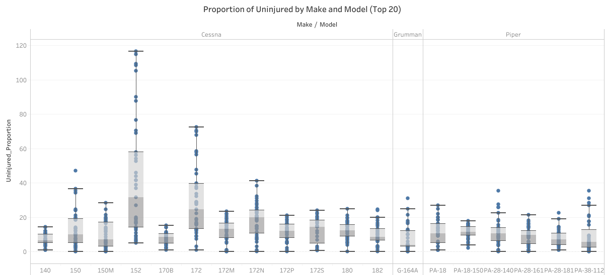
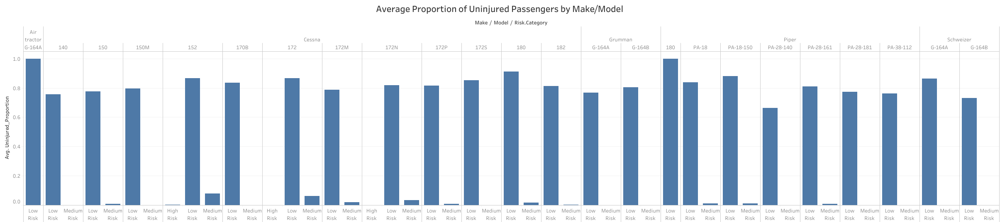

# Aviation Accidents Analysis - Phase 1 Project
## Project Overview

The aviation industry is a critical sector of the global economy. It is a vital link for transportation, commerce, and tourism. Over the years, it has experienced steady growth due to factors such as increasing global connectivity, rising disposable incomes, and technological advancements in aircraft design and operations. According to industry reports, air travel demand has consistently risen, with passenger numbers and cargo volumes showing upward trajectories year over year. From Boeing's Commercial Outlook report 2023-2042, this growth is projected to continue for the foreseeable future. This presents investment opportunities in both the commercial and private entities.

However, as with any new venture, there are risks involved. The purpose of this project is to examine common risks associated with aircraft operations and thus provide insights on the best way forward.

## Business Understanding

Your company is expanding in to new industries to diversify its portfolio. Specifically, they are interested in purchasing and operating airplanes for commercial and private enterprises, but do not know anything about the potential risks of aircraft. You are charged with determining which aircraft are the lowest risk for the company to start this new business endeavor. You must then translate your findings into actionable insights that the head of the new aviation division can use to help decide which aircraft to purchase.


**Problem Statement :** *Determine which aircraft are the lowest risk for the company to purchase and operate, providing actionable insights for decision-making.*


From our dataset, there are a few columns that can be used to determine the risk factor of each Make/Model.
To determine risk, we can use variables such as:
* Incident Frequency: Number of incidents per aircraft make/model.
* Severity of Incidents: Categorized by total fatalities, serious injuries, minor injuries, and uninjured passengers.
* Aircraft Damage: Types of damage recorded (e.g., destroyed, substantial, minor).
* Phase of Flight: Common phases during which incidents occur (e.g., landing, takeoff).
* Weather Conditions: Incidents correlated with different weather conditions.

## Data Understanding

In this project, we will be working with a [Kaggle dataset](https://www.kaggle.com/datasets/khsamaha/aviation-accident-database-synopses/data) from the National Transportation Safety Board that includes aviation accident data from 1962 to 2023 about civil aviation accidents and selected incidents in the United States and international waters.

The data is contained is two separate CSV files: 
1. `AviationData.csv`: each record represents data about an accident that occurred with attributes such ad date, Location etc...
2. `USState_Codes.csv`: the state name and its associated abbreviation

To answer our question, I formulated a few questions to help me simplify it:
1. *What is the distribution of incidents per make/model of aircraft?*
2. *What is the Severity of Injuries per Make/Model ?*
3. *What is the distribution of aircraft damage per Make/Model?*
4. *What is the distribution of Weather Conditions when Incidents occur?*
5. *What is the distribution of Weather Conditions when Incidents occur?*
6. *What is the Risk Score of each Make/Model Combination?*


```python
#plot Make/Model Vs ERCS score 

# Creating a copy to work for this analysis
aviation_filtered1 = aviation_filtered.copy()

# Combine Make and Model columns into a single column
aviation_filtered1['Make_Model'] = aviation_filtered['Make'] + ' ' + aviation_filtered['Model']

# Group by the combined Make/Model column and calculate the mean ERCS
make_model_ercs = aviation_filtered1.groupby('Make_Model')['ERCS.Score'].mean().reset_index()

# Sort the values for better visualization
make_model_ercs = make_model_ercs.sort_values(by='ERCS.Score').head(20)

# Plot the results
plt.figure(figsize=(14, 8))
sns.barplot(x='ERCS.Score', y='Make_Model', data=make_model_ercs, palette='viridis')
plt.title('Mean ERCS Score per Make/Model')
plt.xlabel('Mean ERCS')
plt.ylabel('Make/Model')
plt.xlim(0,5)
plt.show()
```


    


The above image displays the 20 lowest Make/Model combinations by mean ERCS Score. From this alone we cannot select one with the lowest risk as they all have a mean of 0.5. Therfore, we combine our evaluation metrics to draw a clearer picture. 
Our Evaluation metrics are : 1. the quantitative risk score i.e. ERCS score  2. The proportion of uninjured passengers.

Below we see the top 20 Make/Model combinations with the highest number of uninjured passengers. We note that Cessna, Grumman and Piper makes along with the models shown have the highest number of uninjured passengers, thus present the lowest risk.



    
To improve the analysis and support decision-making, we combine our evaluation metrics in one and thus result in the image below. From this Air Tractor G164A, Piper 180 & Piper PA-18-150 are the the top 3 lowest risk aircraft make/model combinations. We can select the top 20 lowest risk aircafts presented here and investigate further into other determinants such as initial capital investment to further narrow down the options.




##  Conclusions
1. Most aircraft Accidents/Incidents occurred during VMC(Visual Meteorological Conditions).
2. Most aircraft incidents/accidents per Make/Model with lower risk have similar incident frequencies and risk scores making it difficult to select just one or two.
3. Most aircrafts sustain substantial damage in the event of an accident.

##  Recommendations
1. Given that VMC is recommended for flying, further investigation should be carried out as to what else could be contributing to this high accidents rate.
2. Conduct further research into the lower risk category of Make/Model combinations and find other considerations e.g.,initial cost of investment.
3. Conduct further investigation as to whether there's correllation between aircraft damage and manufacture or maintenance procedures.

##  Data Visualization
Dashboards are a powerful tool to facilitate data-driven decision making. For this project, [You can access the interactive dashboard here.](https://public.tableau.com/app/profile/vallary.banda/viz/aviation-accident-analysis/Aviation-dashboard)
